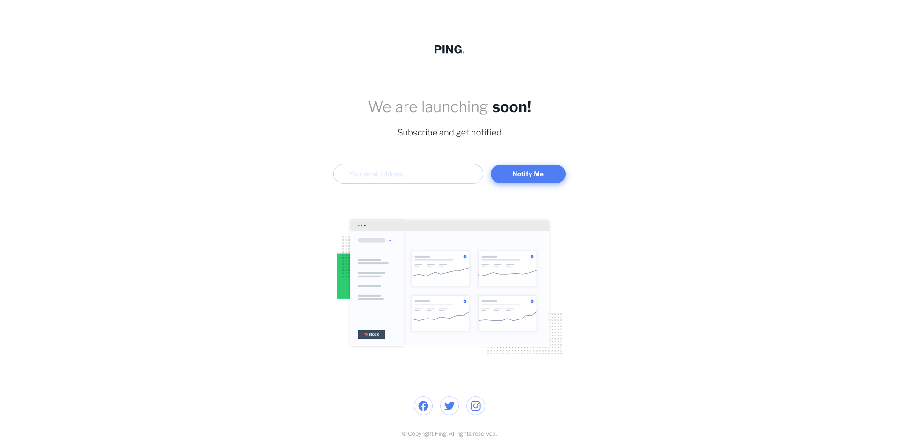

# Frontend Mentor - Ping coming soon page solution

This is a solution to the [Ping coming soon page challenge on Frontend Mentor](https://www.frontendmentor.io/challenges/ping-single-column-coming-soon-page-5cadd051fec04111f7b848da). Frontend Mentor challenges help you improve your coding skills by building realistic projects. 

## Table of contents

- [Overview](#overview)
  - [The challenge](#the-challenge)
  - [Screenshot](#screenshot)
  - [Links](#links)
- [My process](#my-process)
  - [Built with](#built-with)
  - [What I learned](#what-i-learned)
  - [Continued development](#continued-development)
- [Author](#author)

## Overview

### The challenge

Users should be able to:

- View the optimal layout for the site depending on their device's screen size
- See hover states for all interactive elements on the page
- Submit their email address using an `input` field
- Receive an error message when the `form` is submitted if:
	- The `input` field is empty. The message for this error should say *"Whoops! It looks like you forgot to add your email"*
	- The email address is not formatted correctly (i.e. a correct email address should have this structure: `name@host.tld`). The message for this error should say *"Please provide a valid email address"*

### Screenshot

### Links

- Solution URL: [Add solution URL here](https://your-solution-url.com)
- Live Site URL: [Click Here](https://ping-coming-soon-page-brown.vercel.app)

## My process

### Built with

- Semantic HTML5 markup
- CSS custom properties
- Flexbox
- Mobile-first workflow
- [React](https://reactjs.org/) - JS library
- [React-Hook-Form](https://react-hook-form.com) - Library
- [BEM](https://en.bem.info) - CSS architecture

### What I learned

In this particular challenge i've started using react and the very first problem was learning form validation, and for this i used the react hook form library, which made everything more simple, leting only some details to fix. 
Tryied really hard to make all the responsiveness look clean fine, and i think the final product ended up pretty ok. 
I've also tryied to started implementing a CSS architecture (BEM), but since this challenge didn't had such complexity, the pratice wasn't the best, but it was still a experience.

### Continued development

Looking foward to master the form validation using that library and improve my projects, seemed like that library has a lot more to offer. 

## Author

- Frontend Mentor - [@jAllanOli](https://www.frontendmentor.io/profile/jAllanOli)
- gitHub - [@jAllanOli](https://github.com/jAllanOli)